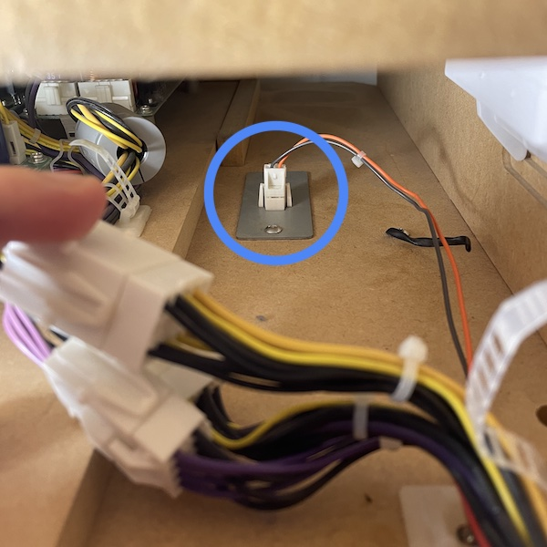
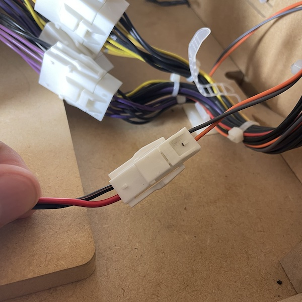
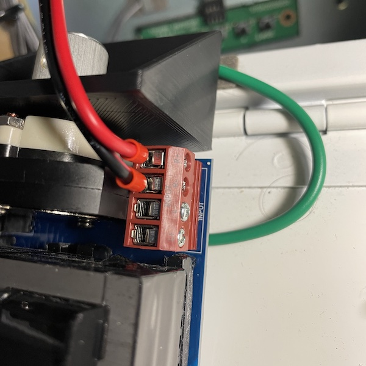
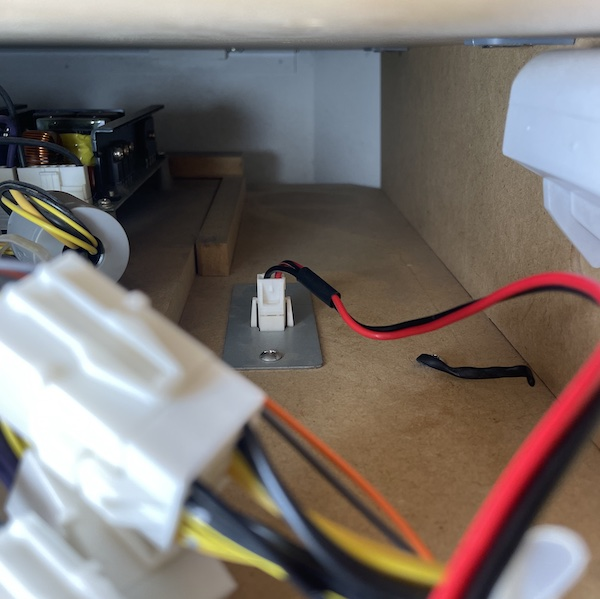
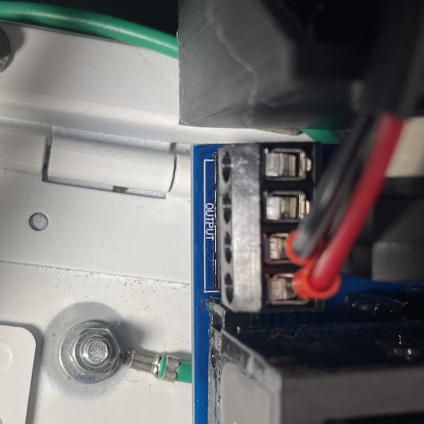
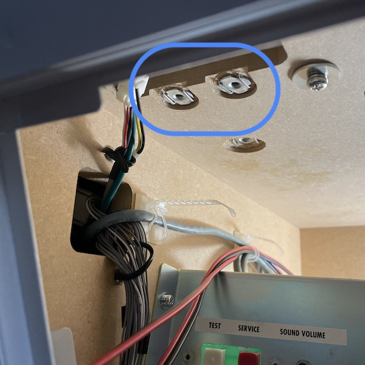
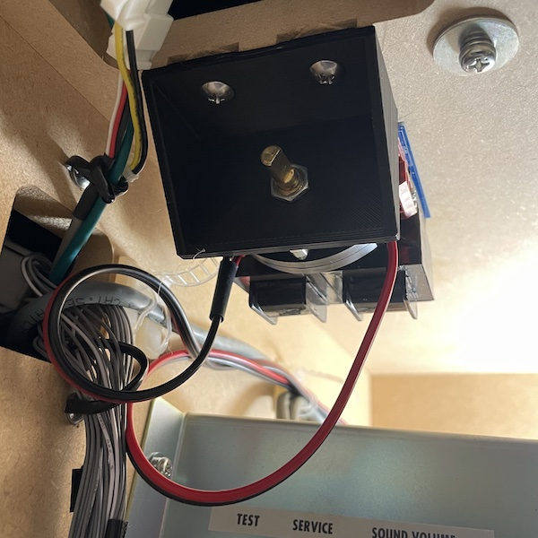
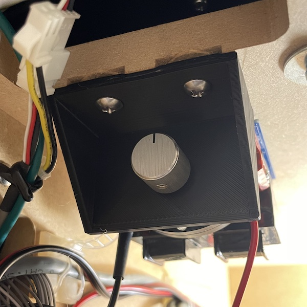

# Chunithm Bass Attenuator

###### a.k.a. how to run a Chunithm cabinet on a non-ground floor without making your neighbors angry

Recently, I acquired an arcade cabinet! It's for a rhythm game called Chunithm, and it's fun to play (at least I think so). Chunithm has a total of four speakers and one subwoofer for audio output, and that subwoofer ***thumps***. It thumps quite loud. It thumps *so loud* at a given relative volume that I need a way to turn it down so I don't make the neighbors angry. Thankfully, SEGA came to the rescue here, because they put two unused holes for me to bolt an off-the-shelf audio attenuator to. Thanks, SEGA!

## Materials

* A 3D print of the `attenuator-bracket.stl` model. If possible, try to print this using a material that is more resistant to heat, such as PETG.
  * While the attenuator doesn't get hot in normal operation, PLA won't hold up well if the cabinet ends up stored somewhere warm for a period of time.
* Two M4x16mm machine bolts. Try to find the ones with the round heads, since they match some of the other bolts used around the cabinet (and make for good replacements of stripped screws).
* One [OSD Audio SVC-100](https://www.osdaudio.com/svc-100-100w-knob-in-wall-volume-control-outdoor-speaker-depot.html). This is an impedance-matching attenuator.
* A pair of JST YL*-02V connectors. You will want one YLR-02V and one YLP-02V, along with their respective pins.
  * These can be found on Aliexpress (cheaper) or eBay (faster in the US).
  * These are _technically_ optional. You _could_ splice into the existing cabinet wiring, but I like to keep things reversible.
* Some red-black wire, ideally 22AWG to match the cabinet wiring.
  *  I used 18AWG, and would highly suggest something closer to what the cabinet has.
* Some wire ferrules to match the wiring you're using.
  * These are _technically_ optional, but strongly suggested. Ferrules provide a better grip strength on the screw terminals and a reduction in resistance. They also prevent any wire fraying or stray copper strands floating about.

## Tools

* Screwdriver, Philips.
* Pliers or a small adjustable wrench, or anything that can tighten the hex nut from the attenuator on the 3D print.
  * You can use your fingers, but you _really_ want this nut tight.
* Wire strippers.
* The requisite crimpers for the JST connector and wire ferrules (if using).
* Some zip ties.
  * These are optional, but I'd suggest them to keep the wiring bundled and clean.

## Steps

* Remove the plastic plate from the attenuator's bracket. Remove the hex nut and washer to separate the attenuator from its stock mounting plate. *Make sure* that the attenuator's switch is set to "1/2x" now; this switch will be harder to access once everything is installed.
* Install the 3D print in place of the attenuator's bracket. Insert the attenuator D-shaft into the 3D print, with the raised surface facing _towards_ the attenuator.
* ***Unplug the cabinet*** and remove the lower back panel from the cabinet.
  * ***While we won't be working near the transformer or where power comes in, removing this panel puts you at risk of touching AC wiring.*** Seriously, just do it, it takes like 5 seconds.
* Locate the plug leading to the subwoofer. Looking into the cabinet, this will be on the right side. Unplug the subwoofer wiring and note the color and order of the wires; we'll use our red wire in place of orange, and black wire in place of grey. 
* Run a length of red-black wire from the front of the cabinet through the back. You want to run enough wire to go from the door on the front of the cabinet to the subwoofer plug.
* To the ends of the wire closest to the subwoofer, strip the red-black wire back and crimp on the pins for the YLR-02V receptable. Once crimped, insert them into the YLR-02V receptacle until you hear a slight click, making sure the order of the wires matches up with the subwoofer plug (similar to the photo below). Plug the subwoofer wiring into the newly-crimped receptacle. If you mess up the wire order, don't panic; a small screwdriver can be used to press on the retention tabs to release the pin. 
* To the ends of the wire closest to the front of the cabinet, strip the red-black wire back and crimp on two ferrules to match the gauge of the wiring. Screw these ferrules down to one of the channels on the "Input" side of the attenuator, routing the red to positive and black to negative.  
* Run a second length of red-black wire from the front of the cabinet through the back. Again, you will want to run enough wire to go from the door on the front of the cabinet to the subwoofer plug.
* To the ends of the wire closest to the subwoofer, strip the red-black wire back and crimp on the pins for the YLP-02V plug. Once crimped, insert them into the YLP-02V receptacle until you hear a slight click, making sure the order of the wires matches up with the subwoofer plug (similar to the photo below). Plug the newly-crimped plug into the subwoofer receptacle. 
* To the ends of the wire closest to the front of the cabinet, strip the red-black wire back and crimp on two ferrules to match the gauge of the wiring. Screw these ferrules down to one of the channels on the "Output" side of the attenuator, routing the red to positive and black to negative. Make sure to use the same channel as the one used on the "Input" side. 
* Install the attenuator using the two M4 screws. Bolt the 3D print to the cabinet using these two holes in the cabinet.  
* Once bolted in place, install the knob by pressing it back on. The installation is now complete! It's suggested to go through the cabinet and tidy up the wiring with the use of zip ties and the pre-placed tie-down points within the cabinet.
  * Or, you can be like me and replace the knob with something a bit nicer-feeling. I found a knob that also happens to have a more logical marking, where pointing straight down is "off". 